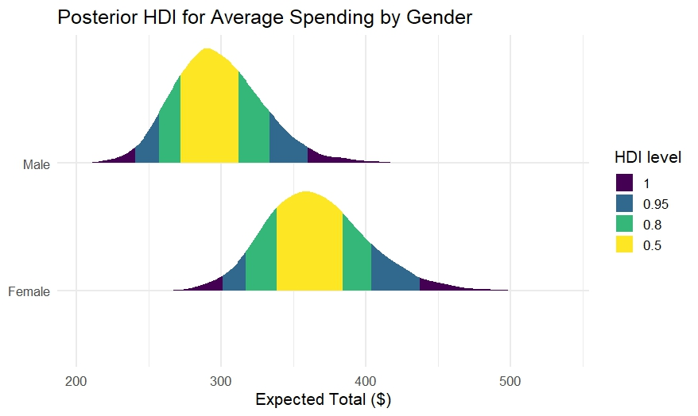

# Bayesian Supermarket Basket Analysis

## Overview

This project applies Bayesian statistical modeling to supermarket transaction data from Myanmar, with the goal of examining whether meaningful differences exist in shopping basket prices across cities and between customer genders.

The analysis focuses on average basket prices, uncertainty quantification, and practical significance using Bayesian posterior inference tools.

## Research Questions

* Are there meaningful differences in the **average shopping basket price** between Yangon, Mandalay, and Naypyitaw?
* Does **customer gender** affect the total basket price in the *Food and Beverages* product line?

## Data

The dataset consists of historical supermarket sales data collected over a three-month period from three branches in Myanmar. Each row represents a single shopping basket and includes:

* City (Yangon, Mandalay, Naypyitaw)
* Product line
* Quantity and unit price
* Total price (including tax)
* Customer gender

## Methods

The analysis includes:

* Bayesian Gaussian modeling for city-level price comparison
* Log-normal modeling for skewed purchase amounts
* Weakly informative priors
* MCMC sampling
* Posterior inference using HDI, ROPE, and Probability of Direction (PD)
* Posterior Predictive Checks (PPC)

## Example Visualizations

### Posterior Mean Basket Prices by City

### Posterior Predictive Distributions by Gender

## Key Findings

* Average basket prices across cities are highly overlapping, with no practically meaningful differences.
* Gender-based differences in food and beverage basket prices are small and inconsistent.
* Most observed variation is attributable to natural variability rather than systematic pricing differences.

## Tools and Technologies

* R
* Bayesian modeling frameworks (e.g., rstan / brms)
* tidyverse
* bayesplot

## Authors

* **Nave Lehavy**
* **Yarden Nativ**
* **Natan Edelman**

## Academic Context

This project was completed as part of a course in Bayesian Modeling at Ben-Gurion University of the Negev.

## Full Report

A detailed methodological and statistical report is available at:

* `report/Bayesian_Supermarket_Analysis_Report.md`
