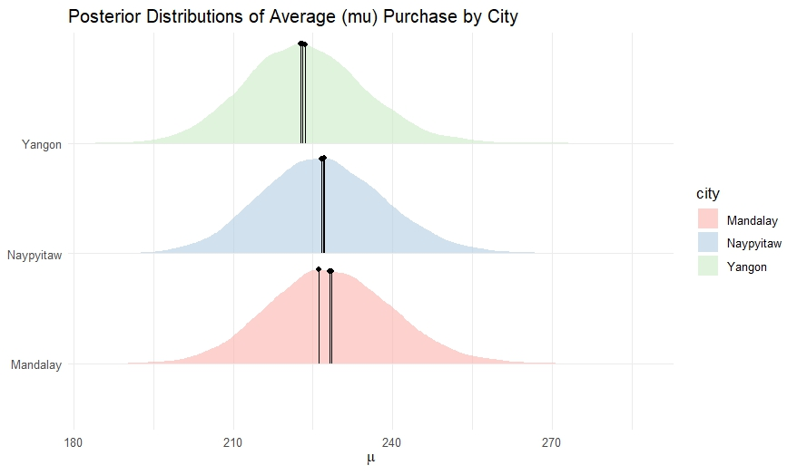

# Bayesian Analysis of Supermarket Basket Prices

## Introduction
Urban growth and increasing supermarket density have intensified local competition, potentially leading to price differentiation across regions or customer groups. This study applies Bayesian statistical modeling to supermarket transaction data from Myanmar in order to examine whether such differences are reflected in shopping basket prices across cities and between customer genders.

The analysis emphasizes uncertainty quantification and practical significance rather than binary hypothesis testing.

---

## Data Description
The dataset consists of transaction-level supermarket sales data collected over a three-month period from three cities in Myanmar: Yangon, Mandalay, and Naypyitaw. Each observation represents a single shopping basket and includes product line, total purchase amount, and customer gender.

---

## Research Questions
1. Are there meaningful differences in the average shopping basket price between cities?
2. Does customer gender influence the total basket price in the *Food and Beverages* product line?

---

## Model 1: City-Level Price Comparison

To compare average basket prices across cities, we assumed a Gaussian data-generating process. To ensure positivity of expected prices, the model was parameterized on the logarithm of the mean.

### Model Specification
- Likelihood: Normal  
- Priors:
  - Log mean price: Normal(3.8, 1)
  - Standard deviation: weakly informative prior

Posterior differences were evaluated using Highest Density Intervals (HDI), Region of Practical Equivalence (ROPE), and Probability of Direction (PD).

### Posterior Distributions by City

### Results
Posterior distributions for Yangon, Mandalay, and Naypyitaw show substantial overlap. No clear separation between cities is observed, indicating high uncertainty relative to any potential differences.

---

## Practical Significance and Hypothesis Evaluation
To assess practical relevance, pairwise differences between city-level posterior means were examined using ROPE (±5 USD).

All posterior mass for the city differences fell entirely within the ROPE, and PD values were close to 50%, suggesting no consistent direction of effect.

---

## Model 2: Gender Effect in Food and Beverages

Purchase amounts in the Food and Beverages product line exhibited right-skewness. Therefore, a log-normal model was used.

### Model Specification
- Outcome: Log-transformed total basket price  
- Predictor: Gender (binary; baseline = women)  
- Parameters:
  - Intercept (baseline mean)
  - Gender effect
  - Shared standard deviation

Weakly informative priors were assigned to all parameters.

### Posterior Estimates by Gender

Posterior summaries suggest slightly higher median predicted spending for women; however, the uncertainty intervals are wide and strongly overlapping.

---

## Posterior Predictive Distributions

To interpret results on the original monetary scale, posterior predictive distributions (PPD) were generated for new customers by gender.

### Posterior Predictive Distributions by Gender

### PPD for New Customers

The predictive distributions show broad overlap, indicating that gender alone provides limited predictive power for basket price.

---

## Differences Between Genders

To directly assess potential gender effects, the posterior predictive distribution of the difference in basket prices (men minus women) was examined.

### Posterior Distribution of Gender Differences

The distribution is centered near zero and includes both positive and negative values. Approximately equal probability is assigned to either gender spending more, indicating no meaningful or consistent difference.

---

## Posterior Predictive Checks

Posterior Predictive Checks (PPC) were conducted to evaluate model fit.

### PPC by Gender

The simulated data broadly reproduce the central tendencies and overall shape of the observed data, although extreme values are not perfectly captured.

---

## Discussion
Across both research questions, the Bayesian analysis provides no strong evidence for meaningful differences in supermarket basket prices by city or by gender. Observed differences are small relative to posterior uncertainty and are likely attributable to natural variability rather than systematic pricing strategies.

---

## Limitations
- Short observation period (three months)
- Limited number of cities
- Distributional assumptions of the models

---

## Conclusion
The findings suggest relatively uniform pricing across locations and customer genders in the studied dataset. From a practical standpoint, supermarkets may benefit more from improving service quality and customer experience than from differentiated pricing strategies based on location or demographic characteristics.

---

## Authors

* **Yarden Nativ**
* **Nave Lehavy**
* **Natan Edelman**
  
## Academic Context

This project was completed as part of a course in Bayesian Modeling at **Ben-Gurion University of the Negev**.
